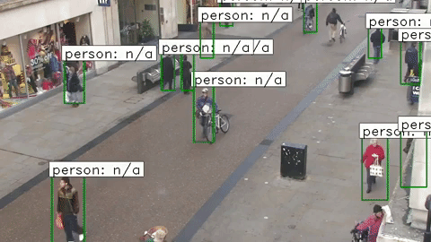

# Real Time Modular Object Detection

This project is aimed to detect any specific type of object in real time by passing a dataset of the object. There are three folders that show the different algorithms in this project. 

- Has support to use [Zynq UltraScale+](https://www.xilinx.com/products/boards-and-kits/zcu104.html) as a processor for optical flow for Faster R-CNN

**Use the _obj-detection-frcnn_ for best results.**

## Dataset
All of the algorithms are tested on the [Town Centre data set](http://www.robots.ox.ac.uk/ActiveVision/Research/Projects/2009bbenfold_headpose/project.html#datasets). 
Results for each algorithm are shown below:

#### Faster R-CNN:

#### U-Net:

#### Optical Flow with a Simple Classifier:


## Prerequisites
- Ubuntu 18.04
- Python 3
- Keras
- Tensorflow
- OpenCV
- Imutils
- Numpy

## Train Models with Town Centre Data Set (Only works for U-Net and Faster R-CNN)
**Note: Make sure to use a computer with a powerful GPU(s) or Google Cloud/Amazon instance with a GPU(s) for best efficiency**
- Download TownCenterXVID.avi from the [Town Centre data set](http://www.robots.ox.ac.uk/ActiveVision/Research/Projects/2009bbenfold_headpose/project.html#datasets) and rename the video to test.avi
- Copy and paste the text from TownCentre-groundtruth.top from the data set website into a file called data.csv
- Create an empty folder called **data** in the corresponding algorithm folder(i.e. obj-detection-frcnn) **where there is a script called create_data.py.**
- Place the test.avi file and data.csv file into the data folder
- Run the create_data.py script with the following command
  ```bash
  python3 create_data.py
  ```
- If using Faster R-CNN, once create_data.py is finished, rename the created train.csv in the data folder to train.txt 
- Run the following command to train the model/weights:
  - If using Faster R-CNN:
    ```bash
    python3 train_frcnn.py -o simple -p data/train.txt
    ```
    **Note: for optional training arguments, read inside train_frcnn.py to find other arguments**
  - If using U-Net:
    ```bash
    python3 train.py
    ```
## Train Models with Custom Data Set
- In order for create_data.py to be used on a custom data set, the data set should be layed out as followed:
  - video of file called test.avi inside of the data folder
  - csv file called data.csv inside of the data folder where each line is configured as shown:
    ```vim
    frame_number, top_left_point_x, top_left_point_y, bottom_right_point_x, bottom_right_point_y
    ```
- When using a custom data set, create_data.py is ran as shown below:
  ```bash
  python3 create_data.py -d custom
  ```
- If using Faster R-CNN, once create_data.py is finished, rename the created train.csv to train.txt 
- Run the following command to train the model/weights:
  - If using Faster R-CNN:
    ```bash
    python3 train_frcnn.py -o simple -p data/train.txt
    ```
    **Note: for optional training arguments, read inside train_frcnn.py to find other arguments**
  - If using U-Net:
    ```bash
    python3 train.py
    ```
## Run Object Detection
**Note: models have to be trained before running object detection.**
- To run the object detection on each algorithm, locate the start.py script in the corresponding algorithm folder and run the following command:
  ```bash
  python3 start.py
  ```
    - **This script has multiple options:**  
     - set ```--wr``` to ```True``` if wanting to save a video  
     - set ```--wf``` to the the number of frames wanting to save to video (otherwise it saves the whole video)  
     - ```--width``` and ```--height``` can be set for a custom image size

## Common Issues
- If the display is having issues running due to D-Bus run the following command:
  ```bash
  sudo killall ibus-daemon
  ```

## Roadmap
- Retrain Faster R-CNN model to be more accurate
  - Train with a faster network
- Implement a faster algorithm able to run object detection at a feasible frame rate
- Link pretrained models

## Sources
Faster R-CNN Implementation:
https://github.com/you359/Keras-FasterRCNN
